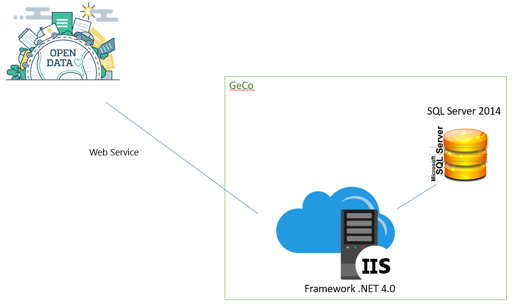

# **Gestione Consiglieri (GeCo)** | *Monitoraggio presenze / assenze*

## Note sul copyright

* Copyright: Consiglio regionale della Lombardia
* Stato del progetto: Stable
* Mantenimento in carico a [Nposistemi S.r.l.](https://www.nposistemi.it)
* Per segnalare CVE e problemi di sicurezza scrivere a helpdesk.software@nposistemi.it

Il logo del Consiglio regionale della Lombardia è di proprietà esclusiva del [Consiglio regionale della Lombardia](https://www.consiglio.regione.lombardia.it/), pertanto dovrà essere sostituito qualora si esegua il download e l'installazione del software. [IL LOGO, SE PRESENTE, SAREBBE MEGLIO TOGLIERLO DAL SORGENTE PUBBLICATO]

## Finalità del software

L'l’applicazione **GeCo** (**GE**stione **CO**nsiglieri) permette la gestione e consultazione di tutti i dati legati all’attività del Consiglio Regionale della Regione Lombardia.

Le entità principali gestibili comprendono i consiglieri e le relative cariche, le legislature, gli organi consiliari, i gruppi politici, le sedute e tutto ciò che è ad esse collegato.

Il sistema permette la gestione delle sedute degli organi consiliari in esso configurati, l'impostazione di presenze/assenze/ritardi di ogni persona coinvolta, con possibilità di indicare anche assenze giustificate per missioni, malattie e sostituzioni.

Sono previsti diversi profili utente, con visibilità su organi e funzionalità differenti, che permettono di definire un workflow per l'invio dei fogli presenza agli uffici preposti.

Infine è disponibile un report mensile, specifico per ciascuno dei profili disponibili, che calcola e mostra a video il riepilogo delle presenze ed assenze di ogni persona. L'algoritmo di calcolo incrocia i dati recuperandoli dai fogli presenze delle sedute dei vari organi e sanando le assenze con le presenze in eventuali sedute concomitanti di altri organi, in base a regole precise stabilite dai decreti dell'Ufficio di Presidenza e codificate all'interno dell'applicativo.

## Struttura del repository

Di seguito l'alberatura del repository:
1. [Documents](Documents/Readme.md) (contiene la documentazione di progetto)
2. [Sources](Sources/Readme.md) (contiene tutti i sorgenti del progetto)
3. [Database](Database/Readme.md) (contiene gli script per la generazione della struttura dati)
4. [Screenshots](Screenshots/Readme.md) (contiene le immagini dell'applicazione)

Il codice sorgente sviluppato per conto del Consiglio regionale della Lombardia e la documentazione prodotta, sono rilasciati con le sottoindicate licenze:
* [AGPL 3.0](https://www.gnu.org/licenses/agpl-3.0.txt) - codice sorgente e base dati
* [CC by 4.0](https://creativecommons.org/licenses/by/4.0/legalcode) - documentazione
Il software GeCo utilizza inoltre alcune librerie di terze parti rilasciate con specifica licenza. L'elenco delle librerie utilizzate e la relativa licenza è presente nella sezione "Licenza" di questo documento.

## Architettura del sistema

GeCo è un'applicazione web sviluppata utilizzando la tecnologia Microsoft ASP.net ed è fruibile utilizzando i più diffusi browser (Ms IE ver.7 e successive, Ms EDGE, Chrome, Firefox). Il sistenma presenta la seguente architettura:

* **Front-end**: Pagine html che costituiscono l'interfaccia utente dell'applicativo.

* **Back-end**: Logica di business sviluppata in c# su Framework .NET che implementa gli algoritmi di calcolo, di generazione di report, di gestione delle viste e dei permessi, di interfaccia con applicazioni esterne, ecc

* **Back-end**: Database SQL Server 2014

* **Integrazione con portale opendata**: Sistema di pubblicazioni **OPENDATA** (Web Services)

* **Integrazione con sistema di autenticazione**: Sistema di autenticazione basato su Active Directory e gestito tramite sistema operativo Windows

GeCo è sviluppato in ASP.net utilizzanto il linguaggio di programmazione C# mediante il [Framework .NET 4.0](https://docs.microsoft.com/it-it/dotnet/). 
Si tratta pertanto di una applicazione [ASP.NET](https://dotnet.microsoft.com/apps/aspnet) che comunica con la base dati in modalità ADO.Net tramite la libreria [System.Data.SqlClient](https://docs.microsoft.com/it-it/dotnet/api/system.data.sqlclient?view=netframework-4.0).

La parte di autenticazione, per poter accedere all'applicazione web, e la gestione dei ruoli/permessi utente è stata realizzata interfacciandosi con repository delle utenze di rete Active Directory presente sul server di Dominio Microsoft Windows utilizzato dal Consiglio regionale della Lombardia per la gestione delle utenze di rete. Tutte regole per le password (regole per ottenere password sicure, scadenza della password, etc...) sono pertanto demandate a tale sistema. 
Il software GeCo è inoltre dotato di un sistema di autenticazione nativo con utenze, password e ruoli memorizzati sul proprio database. Tale autenticazione è attivabile attraverso una configurazione [SPIEGARE]

## Requisiti minimi di sistema

Sia la parte di front-end (sito web [asp.net](https://dotnet.microsoft.com/apps/aspnet)) che quella di back-end (base dati) possono risiedere su un unico server.

Si consiglia [Windows Server 2012 R2](https://docs.microsoft.com/it-it/previous-versions/windows/it-pro/windows-server-2012-R2-and-2012/hh801901(v=ws.11)) (o superiore) con [SQL Server 2014](https://www.microsoft.com/en-us/download/details.aspx?id=42295).

Si rimanda alle specifiche di Microsoft per ottenere i requisiti minimi di sistema.

## Istruzioni per l'installazione

Per l'installazione del sistema operativo, si rimanda al link [Installazione Windows Server 2012 R2](https://docs.microsoft.com/en-us/previous-versions/windows/it-pro/windows-server-2012-R2-and-2012/hh831620(v=ws.11)).

Analogamente, per quanto concerne l'installazione della base dati, si rimanada al link [Installzione SQL Server 2014 Step by Step](https://social.technet.microsoft.com/wiki/contents/articles/23878.sql-server-2014-step-by-step-installation.aspx).

Per l'installazione dell'applicazione web, si rimanda al [manuale di installazione](Documents/Install.md), descritto nella cartalla [Documents](Documents/Readme.md).

## Licenza

Concesso in licenza a norma [AGPL 3.0](https://www.gnu.org/licenses/agpl-3.0.txt) cosi come descritta nel file [LICENSE](LICENSE)

Non è possibile utilizzare l'opera salvo nel rispetto della Licenza.

È possibile ottenere una copia della Licenza al seguente indirizzo: https://www.gnu.org/licenses/agpl-3.0.txt

Salvo diversamente indicato dalla legge applicabile o concordato per iscritto, il software distribuito secondo i termini della Licenza è distribuito "TAL QUALE", SENZA GARANZIE O CONDIZIONI DI ALCUN TIPO, esplicite o implicite.

Si veda la Licenza per la lingua specifica che disciplina le autorizzazioni e le limitazioni secondo i termini della Licenza.

Di seguito una tabella riassuntiva di tutte le componenti (DLL) utilizzate con le relative licenze.

| Componente | Versione | Data | Licenza | Note |
| ----------- | -------- | ---- | ------- | ---- |
| AjaxControlToolkit.dll | 3.0.20380.0 | 23/02/2016 | [BSD 3-Clause](https://github.com/DevExpress/AjaxControlToolkit/blob/master/LICENSE.txt) | [Open Source](https://opensource.org/licenses/BSD-3-Clause) | 
| itextsharp.dll itextsharp.xmlworker.dll | 5.5.9.0 | 09/09/2016 | iTextSharp is licensed as AGPL software. AGPL is a free / open source software license. This doesn't mean the software is gratis! | Buying a license is mandatory as soon as you develop commercial activities distributing the iText software inside your product or deploying it on a network without disclosing the source code of your own applications under the AGPL license. | 
| Microsoft.ReportViewer.Common.dll Microsoft.ReportViewer.WebForms.dll Microsoft.ReportViewer.WinForms.dll | 9.0.21022.8 | 23/02/2016 |  | Copyright © Microsoft Corporation. All rights reserved. | 
| Npo.Fractions.dll | 1.0.0.0 | 21/09/2016 | Copyright © Npo Sistemi srl | La proprietà intellettuale del Software “Npo.Fractions.dll” sviluppata da NPO Sistemi srl, appartiene in via esclusiva ad NPO Sistemi srl, atteso che all’utilizzatore viene attribuito unicamente il diritto d'utilizzo in conformità con i termini indicati dalla legge. | 
| animatedcollapse.js | 2.0 | 24/05/2008 | [MIT License](https://github.com/yuheiy/animated-collapse-element/blob/master/LICENSE) | [Animated Collapsible DIV v2.0- (c) Dynamic Drive DHTML code library](http://www.dynamicdrive.com) | 
| jquery.min.js | 1.3.2 | 19/02/2009 | [Dual licensed under the MIT and GPL licenses.](https://jquery.org/license/) |  | 

## Screenshot

Per poter visionare i vari screenshot applicativi, si rimanda al link [Screenshots](Screenshots/Readme.md).
